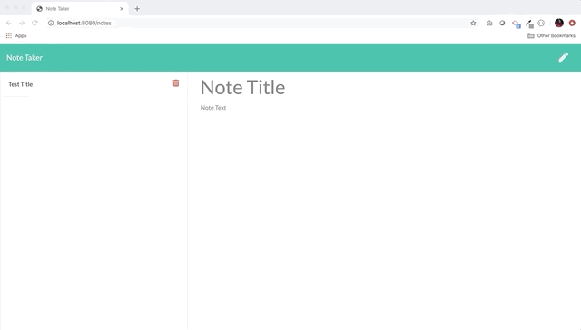

# Note Taker

This is a command-line application that can be used to write, save, and delete notes. This application uses an express backend and save and retrieve note data from a JSON file.

## Demo of Application



## Instructions

Initialize with required npm packages using this command:

```sh
npm install
```

The application will be invoked with the following command:

```sh
node server.js
```

The user will be able to:

* Create new notes
* View notes
* Delete Notes

## User Story

```
AS A user, I want to be able to write and save notes

I WANT to be able to delete notes I've written before

SO THAT I can organize my thoughts and keep track of tasks I need to complete
```

## Business Context

For users that need to keep track of a lot of information, it's easy to forget or be unable to recall something important. Being able to take persistent notes allows users to have written information available when needed.

## Acceptance Criteria

```
Application should allow users to create and save notes.

Application should allow users to view previously saved notes.

Application should allow users to delete previously saved notes.
```

- - -
© 2019 [Madeline Jimenez](https://github.com/mijimenez)